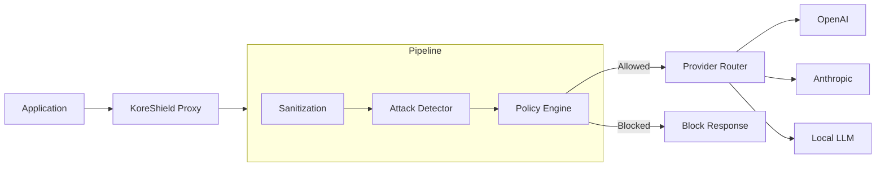

# System Architecture

KoreShield is designed as a modular, high-performance proxy that sits between your application and LLM providers.

## High-Level Diagram

## Core Components

### 1. Proxy Server (`src/koreshield/proxy.py`)
A **FastAPI** application that intercepts incoming requests. It handles authentication, rate limiting (via `slowapi`), and request routing.

### 2. Security Pipeline
The heart of KoreShield. Every request goes through:
- **Sanitization Engine**: Removes PII and normalizes input.
- **Attack Detector**: Uses heuristics and vector logic to identify prompt injections and jailbreaks.
- **Policy Engine**: Evaluates the request against RBAC rules and configured policies.

### 3. State Management
- **Configuration**: Loaded from `config.yaml` and hot-reloaded via Management API.
- **Logs**: JSONL format persistance in `logs/koreshield.log`.
- **Metrics**: Prometheus exporter for observability.

## Deployment Architecture

KoreShield is stateless (except for local log files) and can be horizontally scaled using a load balancer. Configuration is currently file-based but designed to support DB-backed persistence in the future.
